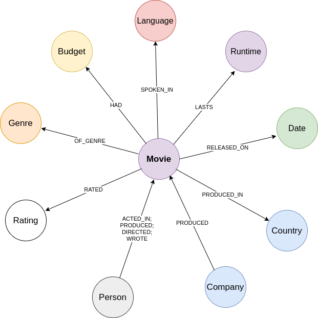
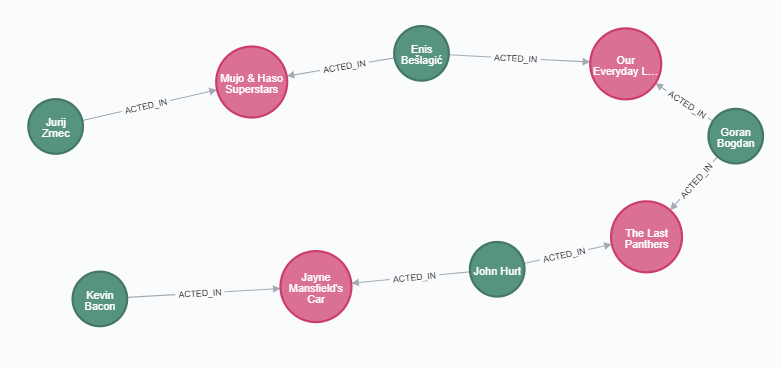

# Movies Graph

The repository contains a ready-made Neo4j graph containing cypher scripts for importing the 
dataset [350 000+ movies from themoviedb.org](https://www.kaggle.com/stephanerappeneau/350-000-movies-from-themoviedborg).
It servers as a great example on how to import and transform tabular data into a property graph model and
 a very good test environment for using cypher in data exploration.
 
## Model
Dataset [350 000+ movies from themoviedb.org](https://www.kaggle.com/stephanerappeneau/350-000-movies-from-themoviedborg) 
contains over 300k movies, from end of 19th century to august 2017. With this data we populate our graph 
(model of the graph is shown below). The graph model is pretty self explanatory.




## Environment setup

**Prerequisites**:  *Make sure you have already installed both Docker Engine and Docker Compose.*

1. First clone the repository in the desired directory `git clone https://github.com/LampicJ15/neo4j-movies.git`.
2. `cd neo4j-movies`
3. Run `docker-compose up -d` (hint: run `docker-compose logs -f` to track log files).
4. Log onto Neo4j browser: http://localhost:7474/browser/.

## Data Import

After you have setup a running Neo4j application, it is time to import the data.
The data and cypher scripts to import it are located in the `neo4j/import` directory. 

First we have to define graph constraints to make our import more efficient.
We can copy the content of the `schema.cypher` file or we can run the following apoc procedure
to make our life easier:
```
CALL apoc.cypher.runSchemaFile("file:///schema.cypher");
```

We then import data about the movies by copying the content of the `import-movies.cypher` file
ou again calling an apoc procedure to do the work for us. 
```
CALL apoc.cypher.runFile("file:///import-movies.cypher");
```

After importing details about the movies all that is left is to import data 
about actor, directors, ... We again do this by either copying the content of the `import-casting.cypher` 
file or by calling the given apoc procedure:
```
CALL apoc.cypher.runFile("file:///import-casting.cypher");
```

## Data Exploring

After the import, everything is up to your imagination when exploring the data.
You can make your own movie recommender or traverse the graph to see how your favourite 
actors are connected to Kevin Bacon (problem known as [Six Degrees of Bacon](https://en.wikipedia.org/wiki/Six_Degrees_of_Kevin_Bacon)).

### Sample Queries
Below we give some sample cypher queries for exploring the movies graph.

- Find all of the movies that Christian Bale acted in.
```
MATCH (:Actor {name:"Christian Bale"})-[:ACTED_IN]->(movie:Movie)
RETURN movie
```
- Find directors that worked with Leonardo DiCaprio most often.
```
MATCH (:Actor {name:"Leonardo DiCaprio"})-[:ACTED_IN]->(movie:Movie)<-[:DIRECTED]-(director:Director)
RETURN director.name, count(director) AS collabs, collect(movie.title) AS movies
ORDER BY collabs DESC LIMIT 5
```

- Retrieve the path from how your favourite actor is related to Kevin Bacon. For example below we show
how a Slovenian actor Jurij Zrnec is related to Kevin Bacon.
```
MATCH (KevinB:Person { name: 'Kevin Bacon' }),(Jurij:Person { name: 'Jurij Zrnec' }), p = shortestPath((KevinB)-[:ACTED_IN*]-(Jurij))
RETURN p
```
We get the following path:
